# Project Setup Guide

Deze handleiding beschrijft hoe je het project lokaal kunt opzetten en gebruiken.

## Vereisten

- **Docker Desktop** (voor PostgreSQL en pgAdmin containers)
- **Neo4j Desktop** (voor lokale Neo4j database)
- **Python 3.12** of hoger
- **Git** (optioneel, voor version control)

## Stap 0: Software Installeren

### Docker Desktop Installeren

Docker Desktop is nodig om de PostgreSQL en pgAdmin containers te kunnen draaien.

#### Windows

1. Download Docker Desktop voor Windows van [docker.com/products/docker-desktop](https://www.docker.com/products/docker-desktop/)
2. Voer het installer bestand uit (`Docker Desktop Installer.exe`)
3. Volg de installatie wizard:
   - Accepteer de licentievoorwaarden
   - Kies "Use WSL 2 instead of Hyper-V" (aanbevolen)
4. Start je computer opnieuw op na installatie
5. Start Docker Desktop vanuit het Start menu
6. Wacht tot Docker volledig gestart is (groen icoontje in systray)

**Verificatie:**
```powershell
docker --version
docker-compose --version
```

**Vereisten voor Windows:**
- Windows 10 64-bit: Pro, Enterprise, of Education (Build 19041 of hoger)
- OF Windows 11 64-bit: Home, Pro, Enterprise, of Education
- WSL 2 moet geïnstalleerd zijn (Docker Desktop installeert dit automatisch)

#### macOS

1. Download Docker Desktop voor Mac van [docker.com/products/docker-desktop](https://www.docker.com/products/docker-desktop/)
2. Open het `.dmg` bestand
3. Sleep Docker naar de Applications folder
4. Start Docker vanuit Applications
5. Geef de benodigde permissies (wachtwoord vereist)

**Verificatie:**
```bash
docker --version
docker-compose --version
```

**Vereisten voor macOS:**
- macOS 11 (Big Sur) of nieuwer
- Apple Silicon (M1/M2) of Intel processor

#### Linux (Ubuntu/Debian)

```bash
# Update package index
sudo apt-get update

# Installeer vereiste packages
sudo apt-get install ca-certificates curl gnupg lsb-release

# Voeg Docker's official GPG key toe
sudo mkdir -p /etc/apt/keyrings
curl -fsSL https://download.docker.com/linux/ubuntu/gpg | sudo gpg --dearmor -o /etc/apt/keyrings/docker.gpg

# Setup repository
echo \
  "deb [arch=$(dpkg --print-architecture) signed-by=/etc/apt/keyrings/docker.gpg] https://download.docker.com/linux/ubuntu \
  $(lsb_release -cs) stable" | sudo tee /etc/apt/sources.list.d/docker.list > /dev/null

# Installeer Docker Engine
sudo apt-get update
sudo apt-get install docker-ce docker-ce-cli containerd.io docker-compose-plugin

# Voeg je gebruiker toe aan docker group (om sudo te vermijden)
sudo usermod -aG docker $USER

# Log opnieuw in of herstart je sessie
newgrp docker
```

**Verificatie:**
```bash
docker --version
docker compose version
```

### Python Installeren

#### Windows

**Optie 1: Van python.org**
1. Download Python 3.12 van [python.org/downloads](https://www.python.org/downloads/)
2. Voer het installer bestand uit
3. **Belangrijk:** Vink "Add Python to PATH" aan onderaan het installatie scherm
4. Klik op "Install Now"
5. Wacht tot installatie compleet is

**Optie 2: Via Microsoft Store**
1. Open Microsoft Store
2. Zoek naar "Python 3.12"
3. Klik op "Get" of "Install"

**Verificatie:**
```powershell
python --version
pip --version
```

Als `python` niet werkt, probeer `py`:
```powershell
py --version
py -m pip --version
```

#### macOS

**Optie 1: Via Homebrew (aanbevolen)**
```bash
# Installeer Homebrew eerst (als je het nog niet hebt)
/bin/bash -c "$(curl -fsSL https://raw.githubusercontent.com/Homebrew/install/HEAD/install.sh)"

# Installeer Python
brew install python@3.12
```

**Optie 2: Van python.org**
1. Download Python 3.12 voor macOS van [python.org/downloads](https://www.python.org/downloads/)
2. Open het `.pkg` bestand
3. Volg de installatie wizard

**Verificatie:**
```bash
python3 --version
pip3 --version
```

#### Linux (Ubuntu/Debian)

```bash
# Update package index
sudo apt-get update

# Installeer Python 3.12
sudo apt-get install python3.12 python3.12-venv python3-pip

# Maak python3.12 de standaard (optioneel)
sudo update-alternatives --install /usr/bin/python3 python3 /usr/bin/python3.12 1
```

**Verificatie:**
```bash
python3 --version
pip3 --version
```

### Git Installeren (Optioneel)

#### Windows

1. Download Git van [git-scm.com/download/win](https://git-scm.com/download/win)
2. Voer de installer uit
3. Gebruik de standaard instellingen (of pas aan naar voorkeur)
4. Kies een teksteditor naar keuze (bijv. VS Code, Notepad++)

**Verificatie:**
```powershell
git --version
```

#### macOS

**Via Homebrew:**
```bash
brew install git
```

**Via Xcode Command Line Tools:**
```bash
xcode-select --install
```

**Verificatie:**
```bash
git --version
```

#### Linux (Ubuntu/Debian)

```bash
sudo apt-get update
sudo apt-get install git
```

**Verificatie:**
```bash
git --version
```

### Git Configuratie (Eerste keer)

```bash
# Configureer je naam en email
git config --global user.name "Jouw Naam"
git config --global user.email "jouw.email@example.com"

# Verificeer configuratie
git config --list
```

## Stap 1: Docker Containers Opzetten

Het project gebruikt Docker Compose om PostgreSQL (met Apache AGE) en pgAdmin te beheren. Neo4j draait lokaal via Neo4j Desktop.

### Docker Compose Configuratie

Je `docker-compose.yml` bevat alleen PostgreSQL en pgAdmin:

```yaml
version: '3.8'

services:
  postgres:
    image: apache/age:latest
    container_name: age-postgres
    environment:
      POSTGRES_USER: admin
      POSTGRES_PASSWORD: admin1234
      POSTGRES_DB: testdb
    ports:
      - "5432:5432"
    volumes:
      - pgdata:/var/lib/postgresql/data
    restart: unless-stopped

  pgadmin:
    image: dpage/pgadmin4:latest
    container_name: pgadmin
    environment:
      PGADMIN_DEFAULT_EMAIL: admin@admin.com
      PGADMIN_DEFAULT_PASSWORD: admin1234
    ports:
      - "8080:80"
    depends_on:
      - postgres
    restart: unless-stopped

volumes:
  pgdata:
```

### Docker Compose Starten

Zorg dat je in de project directory bent en start de containers:

```bash
docker-compose up -d
```

Dit start twee containers op de achtergrond met de volgende configuratie:

- **PostgreSQL (Apache AGE):**
  - Container naam: `age-postgres`
  - Port: `5432`
  - Database: `testdb`
  - Gebruiker: `admin`
  - Wachtwoord: `admin1234`
  - Data persistentie via volume `pgdata`

- **pgAdmin:**
  - Container naam: `pgadmin`
  - Port: `8080` (toegankelijk via `http://localhost:8080`)
  - Email: `admin@admin.com`
  - Wachtwoord: `admin1234`

### Containers Verifiëren

Controleer of beide containers draaien:

```bash
docker-compose ps
```

Of gebruik:
```bash
docker ps
```

Je zou twee containers moeten zien: `age-postgres` en `pgadmin`.

### Logs Bekijken

Als je problemen ondervindt, bekijk dan de logs:

```bash
# Alle services
docker-compose logs

# Alleen PostgreSQL
docker-compose logs postgres

# Alleen pgAdmin
docker-compose logs pgadmin

# Follow mode (real-time)
docker-compose logs -f
```

### Neo4j Desktop Starten

1. Open **Neo4j Desktop**
2. Maak een nieuw project aan (of gebruik bestaand project)
3. Maak een nieuwe database aan:
   - Klik op **Add** → **Local DBMS**
   - Naam: `mobilab-exo` (of een andere naam)
   - Wachtwoord: `admin1234` (of een ander wachtwoord - **onthoud dit!**)
   - Versie: Latest of 5.x
4. Klik op **Start** om de database te starten
5. Wacht tot de status **Active** is
6. Noteer de Bolt URL (meestal `bolt://localhost:7687` of `neo4j://localhost:7687`)

## Stap 2: Database Interfaces Configureren

### pgAdmin Configureren (PostgreSQL)

1. Open je browser en ga naar `http://localhost:8080`
2. Log in met:
   - Email: `admin@admin.com`
   - Wachtwoord: `admin1234`
3. Voeg een nieuwe server toe:
   - Rechtermuisklik op "Servers" → "Register" → "Server"
   - **General tab:**
     - Name: `PostgreSQL AGE Local`
   - **Connection tab:**
     - Host: `postgres` (dit is de service naam in docker-compose)
     - Port: `5432`
     - Database: `testdb`
     - Username: `admin`
     - Password: `admin1234`
     - Save password: ✓
4. Klik op "Save"

**Let op:** Omdat alle containers in hetzelfde Docker netwerk draaien (via docker-compose), gebruik je `postgres` als hostname in plaats van `localhost` of `host.docker.internal`.

### Neo4j Browser Configureren

1. In **Neo4j Desktop**, klik op **Open** bij je actieve database
2. Dit opent automatisch de Neo4j Browser in je webbrowser
3. Of open handmatig: `http://localhost:7474`
4. Verbinding gebeurt automatisch als je vanuit Neo4j Desktop opent
5. Bij handmatige verbinding:
   - **Connect URL:** `neo4j://localhost:7687` (of `bolt://localhost:7687`)
   - **Username:** `neo4j`
   - **Password:** het wachtwoord dat je hebt ingesteld

**Verificatie:**
```cypher
// Test query - tel aantal nodes
MATCH (n) RETURN count(n) as nodeCount;

// Bekijk alle node labels
CALL db.labels();

// Bekijk alle relationship types
CALL db.relationshipTypes();
```

## Stap 3: Python Environment Opzetten

### Virtual Environment Aanmaken

**Windows:**
```powershell
python -m venv venv
venv\Scripts\activate
```

**macOS/Linux:**
```bash
python3 -m venv venv
source venv/bin/activate
```

### Dependencies Installeren

```bash
pip install --upgrade pip
pip install -r requirements.txt
```

De volgende packages worden geïnstalleerd:
- `psycopg2-binary` - PostgreSQL database adapter
- `pandas` - CSV data processing
- `python-dotenv` - Environment variables
- `neo4j` - Neo4j database driver
- `pytest` - Testing framework
- `unittest-xml-reporting` - Test reporting

## Stap 4: Environment Variabelen Configureren

Maak een `.env` bestand aan in de root van het project:

```bash
# PostgreSQL Database configuratie (moet overeenkomen met docker-compose.yml)
DB_USER=admin
DB_PASSWORD=admin1234
DB_HOST=localhost
DB_PORT=5432
DB_NAME=testdb

# CSV directory (absoluut pad of relatief)
CSV_DIR=./csv

# Neo4j configuratie (Neo4j Desktop)
NEO4J_URI=neo4j://localhost:7687
NEO4J_USER=neo4j
NEO4J_PASSWORD=admin1234
```

**Let op:** 
- PostgreSQL waarden komen overeen met `docker-compose.yml`
- Neo4j wachtwoord moet overeenkomen met wat je hebt ingesteld in Neo4j Desktop
- Vanaf je lokale machine (buiten Docker) gebruik je `localhost` als host

**Belangrijke informatie over Neo4j:**
- Als `NEO4J_URI`, `NEO4J_USER` en `NEO4J_PASSWORD` zijn ingevuld, worden de data **dubbel** opgeslagen: in zowel PostgreSQL (AGE) als Neo4j
- Als deze variabelen leeg zijn, wordt alleen PostgreSQL (AGE) gebruikt
- Neo4j URI kan ook `bolt://localhost:7687` zijn (oudere versies)

## Stap 5: Database Schema Initialiseren (Optioneel)

Als je het schema handmatig wilt aanmaken (niet nodig voor de import):

```bash
# Via psql command line
docker exec -it age-postgres psql -U admin -d testdb -f schema.sql
```

Of voer het `schema.sql` bestand uit via pgAdmin:
1. Open pgAdmin
2. Navigeer naar je server → Databases → exo_database
3. Open Query Tool
4. Plak de inhoud van `schema.sql` en voer uit

## Stap 6: CSV Import Uitvoeren

### CSV Bestanden Controleren

Zorg dat alle CSV bestanden aanwezig zijn in de `csv/` directory:

```bash
ls csv/
```

Je zou 24 CSV bestanden moeten zien (9 node types en 15 relatie types).

### Import Script Uitvoeren

```bash
python import_csvs.py
```

De import voert de volgende stappen uit:
1. **Bestaande data wissen** - Verwijdert oude data uit:
   - AGE graph (PostgreSQL)
   - PostgreSQL tabellen
   - Neo4j database (als geconfigureerd)
2. **Nieuwe graph aanmaken** - Maakt een verse `exo_graph` in AGE
3. **FASE 1: Nodes importeren** - Importeert alle entiteiten (Exo, Aim, Dof, etc.) naar:
   - PostgreSQL tabellen (relationele data)
   - AGE graph (graph data)
   - Neo4j (native graph data, als geconfigureerd)
4. **FASE 2: Edges importeren** - Maakt relaties tussen entiteiten in alle databases

**Verwachte output (met Neo4j):**
```
Clearing Neo4j database...
Neo4j database cleared successfully!
Clearing AGE graph 'exo_graph'...
AGE graph cleared successfully!
AGE graph 'exo_graph' created successfully!

============================================================
PHASE 1: Creating all nodes
============================================================

Processing file: Aim.csv
Created PostgreSQL table: Aim
Inserting 20 nodes for table: Aim
[OK] Successfully inserted 20 nodes into PostgreSQL and AGE

...

[OK] Imported into AGE + Neo4j successfully!
```

**Verwachte output (zonder Neo4j):**
```
⚠ Neo4j credentials not configured. Continuing with AGE only...
Clearing AGE graph 'exo_graph'...
AGE graph cleared successfully!
AGE graph 'exo_graph' created successfully!

============================================================
PHASE 1: Creating all nodes
============================================================

Processing file: Aim.csv
Created PostgreSQL table: Aim
Inserting 20 nodes for table: Aim
[OK] Successfully inserted 20 nodes into PostgreSQL and AGE

...

[OK] Imported into AGE successfully! (Neo4j was not available)
```

## Stap 7: Data Verifiëren

### Via pgAdmin (PostgreSQL)

1. Open pgAdmin en navigeer naar je database
2. Open Query Tool
3. Voer AGE setup commands uit:

```sql
LOAD 'age';
SET search_path = ag_catalog, "$user", public;
```

### Via Neo4j Browser

1. Open Neo4j Browser: `http://localhost:7474`
2. Voer Cypher queries uit in de command bar

### Test Queries

**PostgreSQL tabellen (met individuele kolommen):**
```sql
-- Bekijk alle exoskeletten
SELECT _id, exoName, exoManufacturer, exoActivePassive 
FROM Exo 
LIMIT 5;

-- Tel aantal records
SELECT COUNT(*) FROM Exo;
SELECT COUNT(*) FROM Aim;
SELECT COUNT(*) FROM HAS_AIM;
```

**AGE Graph queries:**
```sql
-- Tel alle nodes in de graph
SELECT * FROM cypher('exo_graph', $$
    MATCH (n)
    RETURN count(n) as node_count
$$) AS (node_count agtype);

-- Vind exoskeletten met hun doelstellingen
SELECT * FROM cypher('exo_graph', $$
    MATCH (e:Exo)-[:HAS_AIM]->(a:Aim)
    RETURN e.exoName, a.aimDescription
    LIMIT 10
$$) AS (exo_name agtype, aim_description agtype);
```

**JOINs tussen PostgreSQL tabellen:**
```sql
-- Exoskeletten met hun doelstellingen
SELECT e.exoName, a."aimDescription"
FROM Exo e
JOIN HAS_AIM ha ON e._id = ha.exoId
JOIN Aim a ON ha.aimId = a._id
LIMIT 10;
```

**Neo4j Native Cypher Queries:**
```cypher
// Tel alle nodes
MATCH (n)
RETURN count(n) as total_nodes;

// Bekijk alle node types
MATCH (n)
RETURN DISTINCT labels(n) as node_types, count(*) as count;

// Vind exoskeletten met hun doelstellingen
MATCH (e:Exo)-[:HAS_AIM]->(a:Aim)
RETURN e.exoName, a.aimDescription
LIMIT 10;

// Vind exoskeletten die assisteren in DOFs
MATCH (e:Exo)-[r:ASSISTS_IN]->(d:Dof)
RETURN e.exoName, d.dofDescription, r.direction
LIMIT 10;

// Complexe graph pattern: exoskeletten met hun properties en aims
MATCH (e:Exo)-[:HAS_PROPERTY]->(p:ExoProperty)
MATCH (e)-[:HAS_AIM]->(a:Aim)
RETURN e.exoName, collect(p.exoPropertyName) as properties, 
       collect(a.aimDescription) as aims
LIMIT 5;

// Shortest path tussen twee nodes
MATCH path = shortestPath(
  (start:Exo {exoName: 'CarrySuit'})-[*]-(end:Part)
)
RETURN path
LIMIT 1;
```

## Stap 8: Unit Tests Uitvoeren

Het project bevat unit tests om de import te verifiëren:

```bash
python -m pytest test_csv_import.py -v
```

**Verwachte output:**
```
test_csv_import.py::test_database_connection PASSED
test_csv_import.py::test_csv_files_exist PASSED
test_csv_import.py::test_import_script_exists PASSED
...
```

## Troubleshooting

### Docker Container Start Niet

**Probleem:** Port 5432 of 8080 is al in gebruik
```bash
# Bekijk welke containers draaien
docker ps

# Stop conflicterende containers
docker stop <container-name>

# Of wijzig de ports in docker-compose.yml
```
Als je de ports wijzigt in `docker-compose.yml`, update dan ook `DB_PORT` in je `.env` bestand.

### pgAdmin Kan Niet Verbinden met PostgreSQL

**Probleem:** Connection refused

- **Vanuit pgAdmin container:** Gebruik `postgres` als hostname (service naam)
- **Vanuit je lokale machine:** Gebruik `localhost`
- **Controleer of containers in hetzelfde netwerk zitten:**
  ```bash
  docker network inspect test_cicd_mobilab_default
  ```

### Import Script Geeft Errors

**Probleem:** AGE extensie niet geladen
- Zorg dat je de `apache/age` image gebruikt (niet de standaard postgres image)
- Verifieer met: `docker exec -it age-postgres psql -U admin -d testdb -c "SELECT * FROM pg_extension WHERE extname='age';"`

**Probleem:** Neo4j verbinding mislukt
- Controleer of Neo4j database draait in Neo4j Desktop
- Verificeer dat de database status "Active" is
- Controleer of de Bolt poort (7687) niet bezet is door een andere applicatie
- Verificeer credentials in `.env` bestand (username/wachtwoord uit Neo4j Desktop)
- Test verbinding: open Neo4j Browser via Neo4j Desktop of ga naar `http://localhost:7474`
- Als Neo4j niet nodig is, laat de `NEO4J_*` variabelen leeg in `.env`

**Probleem:** CSV delimiter errors
- De script detecteert automatisch `;` of `,` als delimiter
- Controleer of CSV bestanden geen mixed delimiters bevatten

### Python Dependencies Installeren Mislukt

**Windows:** Mogelijk probleem met psycopg2
```bash
pip install psycopg2-binary --no-cache-dir
```

## Project Structure

```
test_cicd_mobilab/
├── csv/                          # CSV data bestanden
│   ├── Exo.csv
│   ├── Aim.csv
│   └── ...
├── import_csvs.py                # Hoofdscript voor data import
├── test_csv_import.py            # Unit tests
├── requirements.txt              # Python dependencies
├── schema.sql                    # Database schema (optioneel)
├── .env                          # Environment variables (maak zelf aan)
├── .github/workflows/            # CI/CD configuratie
│   └── import_csv.yml
└── README.md                     # Project documentatie
```

## Handige Docker Compose Commands

```bash
# Containers starten
docker-compose up -d

# Containers stoppen (behoud data)
docker-compose stop

# Containers stoppen en verwijderen (behoud volumes)
docker-compose down

# Containers, netwerken én volumes verwijderen (ALLE DATA WEG!)
docker-compose down -v

# Containers herstarten
docker-compose restart

# Specifieke service herstarten
docker-compose restart postgres

# Status bekijken
docker-compose ps

# Logs bekijken
docker-compose logs
docker-compose logs -f postgres  # follow mode voor specifieke service

# PostgreSQL CLI openen
docker exec -it age-postgres psql -U admin -d testdb

# Container shell openen
docker exec -it age-postgres bash
```

## Database Reset

Als je de database volledig opnieuw wilt opzetten:

### Optie 1: Alleen data wissen (containers behouden)
```bash
# Het import script wist automatisch bestaande data
python import_csvs.py
```

### Optie 2: Volledige reset (containers en volumes verwijderen)
```bash
# Stop en verwijder containers + volumes (ALLE DATA WEG!)
docker-compose down -v

# Start containers opnieuw
docker-compose up -d

# Voer import opnieuw uit
python import_csvs.py
```

### Optie 3: Alleen containers herstarten (data behouden)
```bash
# Herstart services
docker-compose restart

# Of stop en start opnieuw
docker-compose down
docker-compose up -d
```

## Volgende Stappen

- **Query Development:** Ontwikkel complexe graph queries met AGE
- **API Development:** Bouw een REST API bovenop de database
- **Visualisatie:** Gebruik tools zoals Neo4j Browser (als je Neo4j ook gebruikt)
- **CI/CD:** GitHub Actions workflow is al geconfigureerd in `.github/workflows/import_csv.yml`

## Applicatie Flow & Data Transfer

### Visuele Diagrammen

```mermaid
graph TD
    A[📁 CSV Bestanden in csv/ folder] --> B[💾 Push naar GitHub Repository]
    B --> C[⚡ GitHub Action Triggered<br/>import_csv.yml]
    C --> D[🧪 Run Unit Tests<br/>pytest test_csv_import.py]
    D --> E{Tests<br/>Passed?}
    E -->|❌ Failed| F[🛑 Stop Workflow<br/>Send Notification]
    E -->|✅ Passed| G[🐍 Run import_csvs.py]
    G --> H[📊 Create PostgreSQL Tables<br/>Individual Columns]
    G --> I[🕸️ Create AGE Graph Nodes<br/>exo_graph]
    G --> N[🔷 Create Neo4j Nodes/Edges<br/>Neo4j Desktop]
    H --> J[(🐘 PostgreSQL Database<br/>testdb)]
    I --> J
    N --> O[(🔷 Neo4j Database<br/>Neo4j Desktop)]
    J --> K[📈 Data in Three Formats:<br/>- SQL Tables<br/>- AGE Graph<br/>- Neo4j Graph]
    O --> K
    K --> L[🔍 Query via pgAdmin<br/>localhost:8080]
    K --> M[💻 Query via Python Scripts<br/>psycopg2/neo4j]
    K --> P[🌐 Query via Neo4j Browser<br/>localhost:7474]
    
    style A fill:#e1f5ff,stroke:#333,stroke-width:2px
    style B fill:#d4edda,stroke:#333,stroke-width:2px
    style C fill:#fff3cd,stroke:#333,stroke-width:2px
    style D fill:#ffeaa7,stroke:#333,stroke-width:2px
    style E fill:#fab1a0,stroke:#333,stroke-width:2px
    style F fill:#ff7675,stroke:#333,stroke-width:2px
    style G fill:#74b9ff,stroke:#333,stroke-width:2px
    style H fill:#a29bfe,stroke:#333,stroke-width:2px
    style I fill:#fd79a8,stroke:#333,stroke-width:2px
    style N fill:#6c5ce7,stroke:#333,stroke-width:2px
    style J fill:#55efc4,stroke:#333,stroke-width:2px
    style O fill:#0984e3,stroke:#333,stroke-width:2px
    style K fill:#00b894,stroke:#333,stroke-width:2px
    style L fill:#fdcb6e,stroke:#333,stroke-width:2px
    style M fill:#e17055,stroke:#333,stroke-width:2px
    style P fill:#00cec9,stroke:#333,stroke-width:2px
```



## Local Development Flow

```mermaid
graph TD
    A[👨‍💻 Developer Werkt Lokaal] --> B[🐳 Docker Compose Up<br/>Start Containers]
    A --> B2[🔷 Start Neo4j Desktop<br/>Local DBMS]
    B --> C1[📦 PostgreSQL + AGE Container<br/>age-postgres:5432]
    B --> C2[🖥️ pgAdmin Container<br/>pgadmin:8080]
    B2 --> C3[🔷 Neo4j Database<br/>localhost:7687]
    C1 --> D[💾 Docker Volume: pgdata<br/>Persistent Storage]
    C3 --> D2[💾 Neo4j Data<br/>Neo4j Desktop Storage]
    A --> E[⚙️ Configure .env File<br/>DB + Neo4j credentials]
    E --> F[🐍 Run import_csvs.py<br/>Locally]
    F --> G[📁 Read CSV Files<br/>from csv/ folder]
    G --> H[🔄 Process with pandas<br/>Parse & Transform Data]
    H --> I1[💾 Insert into PostgreSQL Tables<br/>insert_row_postgres]
    H --> I2[🕸️ Insert into AGE Graph<br/>insert_node_age/insert_edge_age]
    H --> I3[🔷 Insert into Neo4j<br/>insert_node_neo4j/insert_edge_neo4j]
    I1 --> C1
    I2 --> C1
    I3 --> C3
    C1 --> J[✅ Data Available for Queries]
    C3 --> J
    J --> K[🔍 Query via pgAdmin UI]
    J --> L[💻 Query via Python]
    J --> M[📊 SQL Queries on Tables]
    J --> N[🕸️ Cypher Queries on AGE/Neo4j]
    J --> O[🌐 Query via Neo4j Browser]
    
    style A fill:#dfe6e9,stroke:#333,stroke-width:2px
    style B fill:#74b9ff,stroke:#333,stroke-width:2px
    style B2 fill:#6c5ce7,stroke:#333,stroke-width:2px
    style C1 fill:#55efc4,stroke:#333,stroke-width:2px
    style C2 fill:#ffeaa7,stroke:#333,stroke-width:2px
    style C3 fill:#0984e3,stroke:#333,stroke-width:2px
    style D fill:#fd79a8,stroke:#333,stroke-width:2px
    style D2 fill:#74b9ff,stroke:#333,stroke-width:2px
    style F fill:#a29bfe,stroke:#333,stroke-width:2px
    style J fill:#00b894,stroke:#333,stroke-width:2px
```



## Detailed Data Flow

```mermaid
graph LR
    subgraph Input["📥 Input"]
        A1[Exo.csv]
        A2[Aim.csv]
        A3[HAS_AIM.csv]
        A4[24 CSV Files]
    end
    
    subgraph Processing["⚙️ Processing"]
        B1[Read CSV<br/>pandas.read_csv]
        B2[Parse Delimiter<br/>; or ,]
        B3[Create DataFrame]
        B4[Filter Columns<br/>Remove Unnamed]
        B5[Convert Types<br/>Format Values]
    end
    
    subgraph Database["💾 Database Layer"]
        C1[Create Table<br/>IF NOT EXISTS]
        C2[Insert PostgreSQL Row<br/>INSERT INTO]
        C3[Create AGE Node<br/>CREATE node:Label]
        C4[Create AGE Edge<br/>MATCH + CREATE]
        C5[Create Neo4j Node<br/>Neo4j Driver]
        C6[Create Neo4j Edge<br/>Neo4j Driver]
    end
    
    subgraph Storage["🗄️ Storage"]
        D1[(PostgreSQL Tables<br/>Relational Data)]
        D2[(AGE Graph<br/>Graph Data)]
        D3[Docker Volume<br/>pgdata]
        D4[(Neo4j Graph<br/>Native Graph DB)]
        D5[Neo4j Desktop<br/>Data Storage]
    end
    
    subgraph Output["📤 Query Interface"]
        E1[SQL Queries]
        E2[Cypher on AGE]
        E3[Python API]
        E4[pgAdmin UI]
        E5[Neo4j Browser]
        E6[Cypher on Neo4j]
    end
    
    Input --> B1
    B1 --> B2
    B2 --> B3
    B3 --> B4
    B4 --> B5
    B5 --> C1
    C1 --> C2
    C1 --> C3
    B5 --> C4
    B5 --> C5
    B5 --> C6
    C2 --> D1
    C3 --> D2
    C4 --> D2
    C5 --> D4
    C6 --> D4
    D1 --> D3
    D2 --> D3
    D4 --> D5
    D1 --> E1
    D2 --> E2
    D4 --> E6
    D1 --> E3
    D2 --> E3
    D4 --> E3
    E4 --> E1
    E4 --> E2
    E5 --> E6
    
    style Input fill:#e1f5ff,stroke:#333,stroke-width:2px
    style Processing fill:#fff3cd,stroke:#333,stroke-width:2px
    style Database fill:#ffeaa7,stroke:#333,stroke-width:2px
    style Storage fill:#55efc4,stroke:#333,stroke-width:2px
    style Output fill:#a29bfe,stroke:#333,stroke-width:2px
```



## Data Import Process


## Database Structure


## Query Flow


## Docker Compose Architecture


### Key Points:

1. **Dual Storage:** Data wordt opgeslagen in zowel PostgreSQL tabellen (voor SQL) als AGE graph (voor graph queries)
2. **Single Import:** Het `import_csvs.py` script zorgt voor beide in één keer
3. **Persistent Data:** Docker volume `pgdata` bewaart alle data, zelfs na container restart
4. **Network Isolation:** Containers communiceren via Docker network
5. **Flexible Querying:** Gebruik SQL voor relationele queries, Cypher voor graph patterns

## Support

Voor vragen of problemen, raadpleeg:
- [Apache AGE Documentatie](https://age.apache.org/)
- [PostgreSQL Documentatie](https://www.postgresql.org/docs/)
- [pgAdmin Documentatie](https://www.pgadmin.org/docs/)
