# Application Architecture Diagram

## Complete Flow Diagram

```mermaid
graph TD
    A[📁 CSV Bestanden in csv/ folder] --> B[💾 Push naar GitHub Repository]
    B --> C[⚡ GitHub Action Triggered<br/>import_csv.yml]
    C --> D[🧪 Run Unit Tests<br/>pytest test_csv_import.py]
    D --> E{Tests<br/>Passed?}
    E -->|❌ Failed| F[🛑 Stop Workflow<br/>Send Notification]
    E -->|✅ Passed| G[🐍 Run import_csvs.py]
    G --> H[📊 Create PostgreSQL Tables<br/>Individual Columns]
    G --> I[🕸️ Create AGE Graph Nodes<br/>exo_graph]
    H --> J[(🐘 PostgreSQL Database<br/>testdb)]
    I --> J
    J --> K[📈 Data in Both Formats:<br/>- SQL Tables<br/>- Graph Nodes & Edges]
    K --> L[🔍 Query via pgAdmin<br/>localhost:8080]
    K --> M[💻 Query via Python Scripts<br/>psycopg2]
    
    style A fill:#e1f5ff,stroke:#333,stroke-width:2px
    style B fill:#d4edda,stroke:#333,stroke-width:2px
    style C fill:#fff3cd,stroke:#333,stroke-width:2px
    style D fill:#ffeaa7,stroke:#333,stroke-width:2px
    style E fill:#fab1a0,stroke:#333,stroke-width:2px
    style F fill:#ff7675,stroke:#333,stroke-width:2px
    style G fill:#74b9ff,stroke:#333,stroke-width:2px
    style H fill:#a29bfe,stroke:#333,stroke-width:2px
    style I fill:#fd79a8,stroke:#333,stroke-width:2px
    style J fill:#55efc4,stroke:#333,stroke-width:2px
    style K fill:#00b894,stroke:#333,stroke-width:2px
    style L fill:#fdcb6e,stroke:#333,stroke-width:2px
    style M fill:#e17055,stroke:#333,stroke-width:2px
```

## Local Development Flow

```mermaid
graph TD
    A[👨‍💻 Developer Werkt Lokaal] --> B[🐳 Docker Compose Up<br/>Start Containers]
    B --> C1[📦 PostgreSQL + AGE Container<br/>age-postgres:5432]
    B --> C2[🖥️ pgAdmin Container<br/>pgadmin:8080]
    C1 --> D[💾 Docker Volume: pgdata<br/>Persistent Storage]
    A --> E[⚙️ Configure .env File<br/>DB credentials]
    E --> F[🐍 Run import_csvs.py<br/>Locally]
    F --> G[📁 Read CSV Files<br/>from csv/ folder]
    G --> H[🔄 Process with pandas<br/>Parse & Transform Data]
    H --> I1[💾 Insert into PostgreSQL Tables<br/>insert_row_postgres]
    H --> I2[🕸️ Insert into AGE Graph<br/>insert_node_age/insert_edge_age]
    I1 --> C1
    I2 --> C1
    C1 --> J[✅ Data Available for Queries]
    J --> K[🔍 Query via pgAdmin UI]
    J --> L[💻 Query via Python]
    J --> M[📊 SQL Queries on Tables]
    J --> N[🕸️ Cypher Queries on Graph]
    
    style A fill:#dfe6e9,stroke:#333,stroke-width:2px
    style B fill:#74b9ff,stroke:#333,stroke-width:2px
    style C1 fill:#55efc4,stroke:#333,stroke-width:2px
    style C2 fill:#ffeaa7,stroke:#333,stroke-width:2px
    style D fill:#fd79a8,stroke:#333,stroke-width:2px
    style F fill:#a29bfe,stroke:#333,stroke-width:2px
    style J fill:#00b894,stroke:#333,stroke-width:2px
```

## Detailed Data Flow

## Data Import Process

## Database Structure

## Query Flow

## Docker Compose Architecture

```mermaid
graph TB
    subgraph DockerHost["Docker Host Machine"]
        subgraph Network["Docker Network: test_cicd_mobilab_default"]
            subgraph PG["Container: age-postgres"]
                PG1[PostgreSQL Server<br/>Port 5432]
                PG2[Apache AGE Extension]
                PG3[Database: testdb]
            end
            
            subgraph PA["Container: pgadmin"]
                PA1[pgAdmin Web Server<br/>Port 80]
                PA2[Connected to postgres:5432]
            end
        end
        
        subgraph Volumes["Docker Volumes"]
            V1[(pgdata<br/>Persistent Storage)]
        end
        
        subgraph Ports["Port Mapping"]
            P1[Host:5432 → Container:5432]
            P2[Host:8080 → Container:80]
        end
    end
    
    subgraph External["External Access"]
        E1[localhost:5432<br/>PostgreSQL]
        E2[localhost:8080<br/>pgAdmin]
        E3[Python Scripts]
    end
    
    PG --> PA
    PG3 --> V1
    
    P1 --> PG1
    P2 --> PA1
    
    E1 --> P1
    E2 --> P2
    E3 --> E1
    
    style PG fill:#cfe2ff
    style PA fill:#f8d7da
    style Volumes fill:#d1ecf1
    style External fill:#d4edda
```

